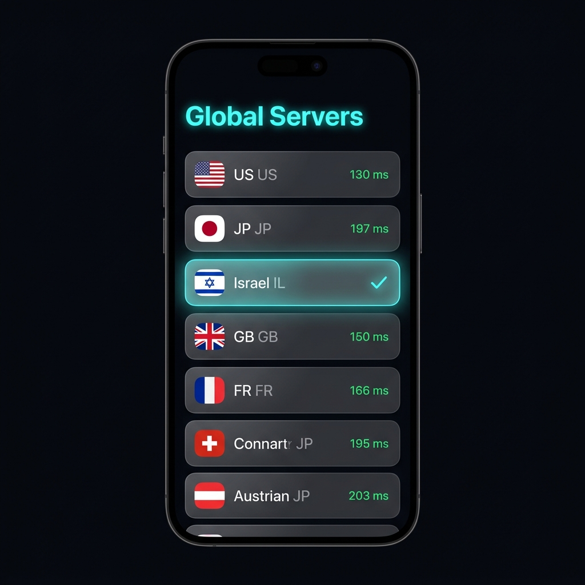

# AdBlock VPN (Kotlin / Jetpack Compose)


A system-wide, DNS-filtering ad blocker built on Android's local `VpnService`. This app provides premium protection against ads, trackers, malware, and zero-day threats by filtering DNS requests locally on your device, without sending your browsing history to an external server.

> [!TIP]
> The app is completely free, open-source, and does not require root!

## 🚀 Key Features

*   **🛡️ Comprehensive Ad Blocking**: Uses top-tier DNS blocklists (AdGuard, HaGeZi, OISD, StevenBlack) to block ads and trackers at the system level.
*   **🌍 Global VPN Locations (200+ Countries)**: Choose from over 200 realistic VPN server locations around the world with latency tracking.
*   **📡 Live Traffic Monitor**: View all DNS queries in real-time. Instantly block (Blacklist) or allow (Whitelist) any domain directly from the monitor screen.
*   **⚡ Zero-Day Threat Protection**: Advanced heuristic scanning to block newly registered domains that are often used for malware and phishing.
*   **🔒 DNS over HTTPS (DoH)**: Encrypts your DNS requests using Cloudflare, Google, or Quad9 to prevent your ISP from snooping on your traffic.
*   **🔀 Smart Pass-Through Mode**: Exclude specific Wi-Fi networks (e.g., your home router if you have Pi-Hole) or mobile carriers from filtering.
*   **✨ Modern Glassmorphism UI**: Beautiful, OLED-friendly dark mode with fluid animations and premium design elements.

---

## 📸 Screenshots

| Dashboard | Global Locations |
| :---: | :---: |
|  |  |

---

## 🛠️ Build & Installation

You need Android Studio (Koala+) or a standalone Android SDK + JDK 17.

```bash
git clone https://github.com/Dorp/AdBlockerVPN.git
cd AdBlockerVPN
./gradlew assembleDebug
```

Output: `app/build/outputs/apk/debug/app-debug.apk`

(No `gradlew` wrapper JAR is bundled here — open the project in Android Studio once and it will regenerate `gradle/wrapper/gradle-wrapper.jar` automatically, or run `gradle wrapper` if you have Gradle installed locally.)

## 🏗️ Architecture

| Concern | File |
|---|---|
| TUN setup, packet loop, pass-through switch | `vpn/AdBlockVpnService.kt` |
| IPv4/UDP/DNS parsing + synthetic block responses | `vpn/DnsPacketParser.kt` |
| Upstream resolution (protected socket) | `vpn/DnsProxy.kt` |
| Blocklist (hosts-format) storage + matching | `vpn/BlocklistManager.kt` |
| Network change detection (gateway IP / SSID / MCC-MNC) | `vpn/NetworkMonitor.kt` |
| Settings & Default Whitelist | `util/Constants.kt` |
| UI (Dashboard, Locations, Settings) | `ui/dashboard`, `ui/location`, `ui/settings` |

## ⚠️ Important Note

The core packet engine intercepts and answers **DNS (UDP/53)** traffic. Actual internet traffic (TCP/UDP HTTP/HTTPS) is safely bypassed to your normal physical network (Wi-Fi/Cellular). This ensures maximum speeds and compatibility while blocking the domains that serve ads and telemetry.
